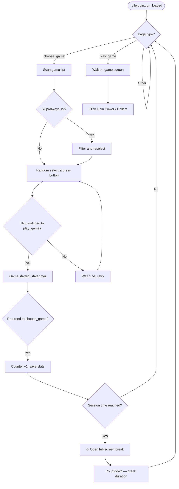

<div align="right">

[](README.tr.md)

</div>

<div align="center">


</div>

<div align="center">


<br/><br/>

[](https://developer.chrome.com/docs/extensions/mv3/)
[](https://developer.mozilla.org/en-US/docs/Web/JavaScript)
[](https://chrome.google.com/webstore)
[](LICENSE)
[](https://github.com/nyx47rd/rchelper/stargazers)

<br/>


[](https://github.com/nyx47rd/rchelper/commits)
[](https://github.com/nyx47rd/rchelper/releases/latest)

</div>

---

## 🚀 What is it?

**RC Helper** is an open-source Chrome extension developed for the [RollerCoin](https://rollercoin.com) platform, providing game automation and power collection convenience (**RollerCoin Helper & Bot**). It does not **play** the games robotically for you — instead, it automatically selects and starts the most suitable game on the game selection screen, and automatically harvests your power (*Gain Power*) when the game is over.

This tool acts as a safe RollerCoin assistant, auto game selector, automatic power collector (*auto collect*), and smart break reminder.

> ⚠️ **Important:** RC Helper is not a cheat or hack tool. It only automates the game *selection* and *collection* processes to save you time and does not violate RollerCoin rules.

<br/>

---

## ✨ Features

<div align="center">

|⚡ Feature |📖 Description |
|:---:|:---|
|🎮 **Auto Select Game** |Randomly selects a non-skipped game, presses the button and starts it.
|💰 **Auto Collect** |Automatically presses the *Gain Power* and *Collect* buttons that appear when the game is over |
|⏸ **Pass** |Skips the selected game for **10 minutes**;automatically returns to the list when time expires |
|🚫 **Always Skip** |**Permanently** blocks the game;will never be selected again |
|📋 **Manage from List** |See all games from the popup and add/remove them to the pass or always skip list with one click |
|☕ **Break Reminder** |At the end of the specified time, the full-screen break timer opens;continues automatically after it finishes |
|⚙️ **Break Settings** |Set game duration (1–120 min) and break time (0.5–60 min) freely from popup |
|📊 **Statistics** |Total/daily/weekly number of games, total time, avg.duration, most played and more |
|🎯 **Now Playing** |The name of the active game and the session counter are displayed live on the widget |
|📈 **Hourly Forecast** |With the EMA algorithm, it predicts how many games you will play per hour based on your current speed |
|🛡️ **Update Protection** |In the old version, auto-play is automatically blocked;popup shows update alert |
|🎓 **Interactive Tutorial** |11-step tour with spotlight on first boot;It can be reopened whenever you want with the `?` button |
|⌨️ **Keyboard Shortcuts** |`S` = Pass · `P` = Always Skip |
|🔊 **Sound Effects** |Different tones for play selection, passing, timeout start/end, automation on/off |
|🗑️ **Clear Memory** |Reset all settings and statistics with one button |
|🤖 **Game Bots** |Auto-play Coin Fisher, Hamster Climber & 2048 Coins when fullscreen. Toggle each bot individually from popup. |

</div>

<br/>

---

## 📦 Installation

### Step 1 — Download Files

[](https://github.com/nyx47rd/rchelper/releases/latest)

Download the `rchelper-vX.X.X.zip` file from the Releases page and extract it to a folder.

---

### Step 2 — Install on Chrome

1. Type `chrome://extensions` in the address bar
2. Turn on **Developer Mode** from the top right corner
3. Press the **"Load unpackaged item"** button
4. Select the `rchelper` folder you extracted
5. ✅ If **RC Helper** appears in the list, the installation is complete

---

### Step 3 — Get Started

1. Go to [rollercoin.com](https://rollercoin.com)
2. Click on the plugin icon in the upper right corner
3. **interactive tutorial** starts automatically at first startup
4. Press the **Auto-Play: OFF** button → **Auto-Play: ON** 🟢

> Live statistics widget appears at the top left of the page.

<br/>

---

## 🖥️ Popup Panel

The popup that opens when the plugin icon is clicked is a 256px wide control panel.Sections:

|Section |Content |
|:---|:---|
|**Title** |RC Helper logo, version information, `?` tutorial button |
|**Update Banner** |If there is a new version, it will be shown automatically, includes a download link |
|**Settings** |Auto Select / Auto Collect / Break Reminder toggles |
|**Break Settings** |Game time and break time numerical inputs |
|**Game Bots** |Toggle Coin Fisher / Hamster Climber / 2048 Coins auto-play individually. Active bots show "PLAYING" badge. |
|**Select from List** |Panel listing all known games (with Pass / Always Skip button) |
|**Pass / Always / List** |Quick action buttons |
|**Auto-Play** |Main on/off button |
|**Missed · 10min** |Temporarily skipped games and remaining times |
|**Always Skipt** |Permanent block list — can be removed with the X button |
|**Statistics** |9 metric stats card + reset button |
|**Clear Memory** |Clears all `chrome.storage.local` data |

<br/>

---

## 📊 In-Page Widget

A fixed card appears in the **upper left corner** of the page.Includes:

- **Session counter** — number of games played in this session
- **Time counter** — time since the beginning of the session (mm:ss)
- **Hourly prediction** — "~X games per hour" prediction based on EMA (appears after at least 3 games)
- **Break status** — remaining time if the break is active, otherwise time until the next break
- **Currently playing** — shows the name of the game when the game starts, hides it when it ends
- **Console** — shows important system messages in red

To close the widget, the upper right `✕` button can be pressed.To open it again, click on the small list icon that will appear in the corner.

<br/>

---

## ☕ Break System

When the break reminder is on, the following loop runs:

```
[Play games] ──(Session time reached)──► [Full-screen break opens]
                                                       │
                                           (Break time ends or
                                            "End Break" clicked)
                                                       │
                                                       ▼
                                              [Auto-resume]
```

A large countdown timer and an "End Break" button appear on the **Break screen**.The hourly forecast calculation automatically deducts break times.

**Break Settings** can be changed from the card in the popup:

|Setting |Default |December |
|:---|:---:|:---:|
|Game time |10 min |1 – 120 min |
|Break time |2.5 min |0.5 – 60 min |

When you change the value and exit the input, it is saved immediately and becomes valid in the active tab.

<br/>

---

## 📈 Statistics

The **Stats** card in the popup is automatically updated every 3 seconds:

|Metric |Description |
|:---|:---|
|**Total Game** |Total games of all time |
|**Today** |Number of games played per day |
|**This Week** |Total of the last 7 days |
|**Total Time** |Total time of all games |
|**Avg.Duration** |Average time per game |
|**Longest** |Longest game played in one go |
|**Most Played** |Favorite game by total number of plays |
|**Last Game** |Name of the last game played |
|**Active Day** |On how many different days were games played?
|**Currently Playing** |Instant active game (queried from content script) |

Data is stored in `chrome.storage.local`.To reset, press the 🔄 icon in the card header.

<br/>

---

## 🎓 Interactive Tutorial

It starts automatically on first installation.It can be reopened whenever you want with the **`?`** button in the popup header.

**11 steps:**

|# |Target |Topic |
|:---:|:---|:---|
|1 |— |Welcome screen |
|2 |Auto Select toggle |Game selection automation |
|3 |AutoCollect toggle |Power collection automation |
|4 |Break Reminder toggle |Break system |
|5 |Break Settings card |Duration customization |
|6 |Pass button |Temporary jump |
|7 |Always Skip button |Permanent block |
|8 |List button |Management from list |
|9 |Auto-Play button |Main control |
|10 |Game Bots card |Bot toggle management |
|11 |Statistics card |Game tracking |

At each step, the target element is highlighted with a **red spotlight**.The description box is positioned automatically and the screen scrolls to the target element.

<br/>

---

## 🛡️ Update Protection

RC Helper checks for the latest version from the GitHub API at every launch.If the version you are using is old:

- Auto-play **automatically blocked**
- An orange **update banner** appears in the popup
- ⚠️ alert shown on widget

This prevents an older version from exhibiting corrupt behavior.

<br/>

---

## ⌨️ Keyboard Shortcuts

<div align="center">

|Key |Action |Detail |
|:---:|:---|:---|
|`S` |**Pass** |Skips current game by 10 minutes |
|`P` |**Always Skip** |Permanently blocks the current game |

</div>

> Only works on `rollercoin.com` when a `input` or `textarea` is not in focus.

<br/>

---

## 🔒 Permissions

<div align="center">

|Permission |Why Necessary |
|:---:|:---|
|`activeTab` |To run script in active tab |
|`scripting` |To inject content script into the page |
|`tabs` |Popup → for cross-tab messaging |
|`storage` |To permanently save settings, statistics and skipped games |

</div>

<br/>

---

## ❓ Frequently Asked Questions

**Auto-Play does not open, what should I do?**
You are probably using an old version.If an update banner appears in the popup, download the latest version and reinstall it.

**The name of the game appears as "Game-XXXX".**
The game on the game selection page has not yet loaded name information.It will be fixed when you refresh the page.

**The game I passed is still being selected.**
The jump list is automatically cleared after 10 minutes.Use "Always Skip" if you don't want it to be selected before time runs out.

**The break screen opens too often/less often.**
Increase or decrease game time from the Popup → Break Settings card.

**Statistics reset / lost.**
The "Clear Memory" button clears the entire `chrome.storage.local`.This button should be pressed carefully.

**Widget does not appear on the page.**
Refresh the page.The plugin is installed as a content script;It may start delayed on some pages.

**Game bot doesn't start automatically.**
Make sure the bot is enabled in Popup → Game Bots card. The bot only activates when you go fullscreen.

<br/>

---

## ☁️ Cloud-Based Battery Automator (Hugging Face & Selenium)

RC Helper supports headless cloud-based automation. This allows you to automatically recharge your RollerCoin batteries 24/7 without keeping your computer running, utilizing Hugging Face Spaces (Docker + Selenium) and a cron-job service (e.g., cron-job.org).

### 1. Configure Automatic Token Synchronization (Recommended) 🔑

This automation requires RollerCoin session tokens to function. Our extension automatically syncs these tokens to your Hugging Face Spaces server using End-to-End Encryption (E2EE):

1. When you open the **"Cloud Sync"** section in the extension's popup interface, click the copy button next to the automatically generated, read-only **Sync Password** to copy it.
2. Create your Hugging Face Space (See Step 2).
3. From your Space dashboard, go to the **Settings** -> **Variables and Secrets** section and click the **New Secret** button to create a secret named **`SYNC_PASSWORD`**, then paste the copied password as its value.
4. Enable the **Auto Sync** option in the extension.
5. Enter your Hugging Face Space URL in the **Space URL** field (e.g., `https://username-space.hf.space`).
6. *(Optional)* If you set your Hugging Face Space to **Private**, enter your Hugging Face Access Token (`hf_...`) under the **HF Token** field.
7. Click the **"Sync Now"** button to perform the first synchronization. The extension will automatically encrypt and sync your tokens in the background as they change while you are logged in.
8. You can click the **"?"** help button next to the Cloud Sync title in the extension to view this step-by-step guide and description at any time.

*(Alternative - Manual Method)*: If you do not wish to use automatic sync, you can manually copy tokens from RollerCoin using the Developer Tools Console (F12) via `console.log("RC_TOKEN:", localStorage.getItem("token")); console.log("RC_REFRESH_TOKEN:", localStorage.getItem("refreshToken"));` and define them manually as `RC_TOKEN` and `RC_REFRESH_TOKEN` secrets in Hugging Face.

---

### 2. Hugging Face Space Creation Steps 🚀
1. Go to [Hugging Face](https://huggingface.co) and log in.
2. Click on your profile picture in the top-right corner and select **New Space**.
3. Fill out the fields:
   * **Space Name:** Choose a name (e.g., `my-rc-battery-automator`).
   * **License:** `mit` (or choose any).
   * **Select Space SDK:** Select **Docker**.
   * **Choose a Docker template:** Select **Blank**.
   * **Space Hardware:** Select the free CPU basic tier.
   * **Privacy:** Set to **Public** or **Private** (Private is recommended for privacy).
4. Click **Create Space**.

---

### 3. Required Deployment Files (Full Contents) 📄
In your newly created Space, navigate to the **Files** tab, click **Contribute**, and select **Upload files** or **Create a new file** to add/create the following **3 files** in the root directory:

#### 📁 `requirements.txt`
```text
flask
selenium
webdriver-manager
cryptography
```

#### 📁 `Dockerfile`
```dockerfile
FROM python:3.10-slim

# Install system dependencies for Google Chrome
RUN apt-get update && apt-get install -y \
    wget \
    gnupg \
    unzip \
    curl \
    libglib2.0-0 \
    libnss3 \
    libfontconfig1 \
    libxss1 \
    libxtst6 \
    libxslt1.1 \
    libxml2 \
    libasound2 \
    libgbm1 \
    && rm -rf /var/lib/apt/lists/*

# Install Google Chrome Stable
RUN curl -sSL https://dl.google.com/linux/linux_signing_key.pub \
    | gpg --dearmor -o /usr/share/keyrings/google-chrome.gpg \
    && echo "deb [arch=amd64 signed-by=/usr/share/keyrings/google-chrome.gpg] http://dl.google.com/linux/chrome/deb/ stable main" \
    > /etc/apt/sources.list.d/google-chrome.list \
    && apt-get update \
    && apt-get install -y google-chrome-stable \
    && rm -rf /var/lib/apt/lists/*

# Set working directory
WORKDIR /app

# Copy requirements and install python packages
COPY requirements.txt .
RUN pip install --no-cache-dir -r requirements.txt

# Copy all project files (including the rchelper extension folder)
COPY . .

# Expose Flask default port for Hugging Face (7860)
EXPOSE 7860

# Run the Flask app
CMD ["python", "app.py"]
```

#### 📁 `app.py`
```python
from flask import Flask, jsonify, render_template_string, request
from selenium import webdriver
from selenium.webdriver.chrome.options import Options
from selenium.webdriver.chrome.service import Service
from selenium.webdriver.common.by import By
from webdriver_manager.chrome import ChromeDriverManager
import time
import os
import urllib.request
import json
import zipfile
import shutil
import base64
import random
from datetime import datetime
from cryptography.hazmat.primitives.kdf.pbkdf2 import PBKDF2HMAC
from cryptography.hazmat.primitives import hashes
from cryptography.hazmat.primitives.ciphers.aead import AESGCM

app = Flask(__name__)

# ROLLERCOIN AUTHENTICATION CONFIGURATION (FALLBACK / MANUAL):
# You can paste your token values below inside the quotes,
# OR for better security, leave them as is and set them in your Space settings:
# Settings -> Variables and Secrets -> New Secret:
#   Name = 'RC_TOKEN', Value = 'your_token_here'
#   Name = 'RC_REFRESH_TOKEN', Value = 'your_refresh_token_here'
#   Name = 'SYNC_PASSWORD', Value = 'your_sync_password_here' (Recommended for auto-sync)
RC_TOKEN_VALUE = os.environ.get("RC_TOKEN", "PASTE_YOUR_TOKEN_HERE")
RC_REFRESH_TOKEN_VALUE = os.environ.get("RC_REFRESH_TOKEN", "PASTE_YOUR_REFRESH_TOKEN_HERE")

SCREENSHOTS_DIR = "/app/screenshots"
os.makedirs(SCREENSHOTS_DIR, exist_ok=True)

# Store the latest run results globally
latest_run = {"steps": [], "timestamp": None}

def download_and_extract_latest_extension():
    try:
        print("[Extension Manager] Fetching latest release info from GitHub...")
        req = urllib.request.Request(
            "https://api.github.com/repos/nyx47rd/rchelper/releases/latest",
            headers={"User-Agent": "Mozilla/5.0"}
        )
        with urllib.request.urlopen(req) as response:
            data = json.loads(response.read().decode())
            
        zip_url = None
        for asset in data.get("assets", []):
            if asset.get("name", "").startswith("rchelper") and asset.get("name", "").endswith(".zip"):
                zip_url = asset.get("browser_download_url")
                break
                
        if not zip_url:
            print("[Extension Manager] No ZIP asset found in latest release! Using existing local files.")
            return False
            
        zip_path = "/tmp/rchelper_latest.zip"
        print(f"[Extension Manager] Downloading latest release from {zip_url}...")
        urllib.request.urlretrieve(zip_url, zip_path)
        
        extract_dir = "/app/rchelper"
        tmp_extract = "/tmp/rchelper_extract"
        if os.path.exists(tmp_extract):
            shutil.rmtree(tmp_extract)
        os.makedirs(tmp_extract, exist_ok=True)
        
        print("[Extension Manager] Extracting ZIP...")
        with zipfile.ZipFile(zip_path, 'r') as zip_ref:
            zip_ref.extractall(tmp_extract)
            
        source_folder = os.path.join(tmp_extract, "rchelper")
        if os.path.exists(source_folder):
            if os.path.exists(extract_dir):
                shutil.rmtree(extract_dir)
            shutil.move(source_folder, extract_dir)
            print(f"[Extension Manager] Successfully updated extension to {extract_dir}")
        else:
            print("[Extension Manager] Could not find 'rchelper' directory in ZIP extraction!")
            return False
            
        if os.path.exists(zip_path):
            os.remove(zip_path)
        if os.path.exists(tmp_extract):
            shutil.rmtree(tmp_extract)
            
        return True
    except Exception as e:
        print(f"[Extension Manager] Error downloading extension: {str(e)}")
        return False

def save_screenshot(driver, name):
    """Take a screenshot and save it to the screenshots directory."""
    path = os.path.join(SCREENSHOTS_DIR, f"{name}.png")
    driver.save_screenshot(path)
    print(f"[Screenshot] Saved: {path}")
    return path

@app.route('/')
def index():
    return "RC Helper Cloud Server is running! Trigger: /tetikle-batarya | Results: /sonuc"

@app.route('/guncelle-token', methods=['POST'])
def update_token():
    try:
        data = request.get_json()
        if not data or not all(k in data for k in ("ciphertext", "iv", "salt")):
            return jsonify({"status": "error", "message": "Missing encrypted payload fields"}), 400
        
        # Write encrypted payload directly to tokens.json
        with open("/app/tokens.json", "w") as f:
            json.dump(data, f)
            
        return jsonify({"status": "success", "message": "Tokens saved securely in encrypted format."}), 200
    except Exception as e:
        return jsonify({"status": "error", "message": str(e)}), 500

@app.route('/tetikle-batarya', methods=['GET', 'POST'])
def trigger_battery():
    global latest_run
    
    # E2EE Decryption logic
    sync_password = os.environ.get("SYNC_PASSWORD")
    rc_token = RC_TOKEN_VALUE
    rc_refresh_token = RC_REFRESH_TOKEN_VALUE
    token_src = "Environment Secrets"
    
    if sync_password and os.path.exists("/app/tokens.json"):
        try:
            with open("/app/tokens.json", "r") as f:
                enc_data = json.load(f)
            
            ciphertext = base64.b64decode(enc_data["ciphertext"])
            iv = base64.b64decode(enc_data["iv"])
            salt = base64.b64decode(enc_data["salt"])
            
            kdf = PBKDF2HMAC(
                algorithm=hashes.SHA256(),
                length=32,
                salt=salt,
                iterations=100000,
            )
            key = kdf.derive(sync_password.encode())
            
            aesgcm = AESGCM(key)
            decrypted_bytes = aesgcm.decrypt(iv, ciphertext, None)
            decrypted_data = json.loads(decrypted_bytes.decode('utf-8'))
            
            rc_token = decrypted_data["token"]
            rc_refresh_token = decrypted_data["refreshToken"]
            token_src = "Decrypted tokens.json"
            print("[Decryption] Tokens successfully loaded and decrypted from tokens.json")
        except Exception as e:
            print(f"[Decryption Error] {str(e)}")
            
    if rc_token == "PASTE_YOUR_TOKEN_HERE" or rc_refresh_token == "PASTE_YOUR_REFRESH_TOKEN_HERE":
        return jsonify({
            "status": "error",
            "message": "Authentication tokens are not configured. Please set them via the extension or HF Secrets."
        }), 400

    # Clear old screenshots
    for f in os.listdir(SCREENSHOTS_DIR):
        os.remove(os.path.join(SCREENSHOTS_DIR, f))
    
    steps = []
    latest_run = {"steps": steps, "timestamp": datetime.utcnow().strftime("%Y-%m-%d %H:%M:%S UTC")}
    steps.append(f"ℹ️ Token Source: {token_src}")

    # Random delay (1 to 15 seconds) to prevent exact-time bot detection
    delay = random.randint(1, 15)
    print(f"[Anti-Bot] Waiting for {delay} seconds before starting...")
    steps.append(f"🕒 Anti-bot delay: Waited {delay} seconds.")
    time.sleep(delay)

    # Automatically fetch and extract the latest extension release
    print("[Extension Manager] Checking and updating extension...")
    download_success = download_and_extract_latest_extension()
    
    if not download_success and not os.path.exists("/app/rchelper"):
        steps.append("❌ Failed to download the extension and no local copy exists.")
        return jsonify({"status": "error", "message": steps[-1], "steps": steps}), 500

    steps.append("✅ Extension ready.")

    print("[Selenium] Starting Chrome Webdriver...")
    options = Options()
    options.add_argument("--headless=new")
    options.add_argument("--no-sandbox")
    options.add_argument("--disable-dev-shm-usage")
    options.add_argument("--disable-gpu")
    options.add_argument("--window-size=1920,1080")
    # Anti-bot detection measures
    options.add_argument("--disable-blink-features=AutomationControlled")
    options.add_experimental_option("excludeSwitches", ["enable-automation"])
    options.add_experimental_option('useAutomationExtension', False)
    options.add_argument("user-agent=Mozilla/5.0 (Windows NT 10.0; Win64; x64) AppleWebKit/537.36 (KHTML, line Gecko) Chrome/120.0.0.0 Safari/537.36")

    driver = None
    try:
        service = Service(ChromeDriverManager().install())
        driver = webdriver.Chrome(service=service, options=options)
        
        # Modify webdriver flag to bypass basic bot detection
        driver.execute_cdp_cmd('Page.addScriptToEvaluateOnNewDocument', {
            'source': 'Object.defineProperty(navigator, "webdriver", {get: () => undefined})'
        })
        
        # Step 1: Open RollerCoin homepage
        print("[Selenium] Opening RollerCoin...")
        driver.get("https://rollercoin.com")
        time.sleep(3)
        save_screenshot(driver, "01_homepage")
        steps.append("✅ RollerCoin homepage loaded.")
        
        # Step 2: Inject authentication tokens
        print("[Selenium] Injecting tokens...")
        driver.execute_script(f"localStorage.setItem('token', '{rc_token}');")
        driver.execute_script(f"localStorage.setItem('refreshToken', '{rc_refresh_token}');")
        steps.append("✅ Tokens injected into Local Storage.")
        
        # Step 3: Navigate to game page
        print("[Selenium] Navigating to /game...")
        driver.get("https://rollercoin.com/game")
        time.sleep(8)
        save_screenshot(driver, "02_game_page")
        steps.append("✅ Game page loaded.")
        
        # Step 4: Check login status
        current_url = driver.current_url
        if "sign-in" in current_url or "login" in current_url:
            save_screenshot(driver, "03_login_redirect")
            steps.append("❌ Redirected to login — tokens may be expired!")
            driver.quit()
            return jsonify({"status": "error", "steps": steps, "view_results": "/sonuc"}), 401
        
        steps.append(f"✅ Logged in. URL: {current_url}")

        # Step 5: Find the battery recharge button
        print("[Selenium] Searching for battery button...")
        button = None
        button_method = ""
        
        try:
            button = driver.find_element(By.CSS_SELECTOR,
                'button:has(div[style*="mask-image"][style*="svg"])')
            button_method = "CSS :has() selector"
        except Exception:
            pass
        
        if not button:
            try:
                candidates = driver.find_elements(By.CSS_SELECTOR,
                    "button.custom-button.small.primary")
                for c in candidates:
                    if c.find_elements(By.CSS_SELECTOR, "div[style*='mask-image']"):
                        button = c
                        button_method = "class + inner style check"
                        break
            except Exception:
                pass

        if not button:
            try:
                button = driver.execute_script("""
                    for (const btn of document.querySelectorAll('button')) {
                        const d = btn.querySelector('div[style*="mask-image"]');
                        if (d && d.style.maskImage && d.style.maskImage.includes('.svg'))
                            return btn;
                    }
                    return null;
                """)
                if button:
                    button_method = "JavaScript DOM search"
            except Exception:
                pass

        if not button:
            save_screenshot(driver, "03_button_not_found")
            steps.append("❌ Battery button NOT found on the page.")
            driver.quit()
            return jsonify({"status": "error", "steps": steps, "view_results": "/sonuc"}), 404
        
        save_screenshot(driver, "03_button_found")
        # Check if the button is actually disabled (either via attribute or class name)
        is_disabled = (
            button.get_attribute("disabled") is not None or 
            "disabled" in (button.get_attribute("class") or "").lower()
        )
        steps.append(f"✅ Button found via: {button_method} (disabled={is_disabled})")

        # Step 6: Click the button
        if is_disabled:
            steps.append("ℹ️ Battery is already charged / recharge button is currently disabled. Skipping click to prevent bot detection.")
            print("[Selenium] Battery already charged or button is disabled. Skipping click for safety.")
        else:
            try:
                # Use ActionChains to simulate organic cursor hover and click
                from selenium.webdriver.common.action_chains import ActionChains
                actions = ActionChains(driver)
                actions.move_to_element(button).pause(random.uniform(0.6, 1.8)).click().perform()
                steps.append("✅ Battery button clicked organically via cursor move (ActionChains)!")
            except Exception as click_err:
                print(f"[Selenium] Organic click failed, falling back to script click: {str(click_err)}")
                driver.execute_script("arguments[0].click();", button)
                steps.append("✅ Battery button clicked via fallback JavaScript event.")
            time.sleep(5)
            save_screenshot(driver, "04_after_click")

        save_screenshot(driver, "05_final_state")
        steps.append("✅ Done. Visit /sonuc to see screenshots.")
        
        driver.quit()
        return jsonify({"status": "success", "steps": steps, "view_results": "/sonuc"}), 200

    except Exception as e:
        if driver:
            try:
                save_screenshot(driver, "99_error")
                driver.quit()
            except Exception:
                pass
        steps.append(f"❌ Error: {str(e)}")
        return jsonify({"status": "error", "steps": steps, "view_results": "/sonuc"}), 500

@app.route('/sonuc')
def sonuc():
    """Visual results page showing screenshots from the latest run."""
    screenshots = sorted([f for f in os.listdir(SCREENSHOTS_DIR) if f.endswith('.png')])
    images_html = ""
    for ss in screenshots:
        with open(os.path.join(SCREENSHOTS_DIR, ss), 'rb') as f:
            b64 = base64.b64encode(f.read()).decode()
        label = ss.replace(".png", "").replace("_", " ").title()
        images_html += f'<div style="margin:20px 0;"><h3 style="color:#9ca3af;">{label}</h3>'
        images_html += f'</div>'
    
    steps_html = ""
    for step in latest_run.get("steps", []):
        steps_html += f"<li style='margin:6px 0;'>{step}</li>"

    return render_template_string("""<!DOCTYPE html>
    <html><head><title>RC Helper - Results</title><meta charset="utf-8"/>
    <style>
        body { background:#0f172a; color:#e2e8f0; font-family:'Segoe UI',sans-serif;
               margin:0; padding:20px; text-align:center; }
        h1 { color:#38bdf8; } h2 { color:#94a3b8; }
        ul { text-align:left; max-width:800px; margin:20px auto; font-size:16px; line-height:1.8; }
        .ts { color:#64748b; font-size:14px; }
        img { box-shadow:0 4px 20px rgba(0,0,0,0.5); }
    </style></head><body>
        <h1>🔋 RC Helper — Battery Automation Results</h1>
        <p class="ts">Last run: {{ timestamp or 'No runs yet' }}</p>
        <h2>📋 Steps</h2><ul>{{ steps_html | safe }}</ul>
        <h2>📸 Screenshots</h2>{{ images_html | safe }}
        <br/><p style="color:#475569;">Refresh after triggering /tetikle-batarya to see new results.</p>
    </body></html>""", steps_html=steps_html, images_html=images_html,
         timestamp=latest_run.get("timestamp"))

if __name__ == '__main__':
    # Hugging Face default port is 7860
    app.run(host='0.0.0.0', port=7860)
```

Once the files are uploaded, configure your encryption key:
* Navigate to the Space **Settings** tab, scroll down to **Variables and Secrets**, click **New Secret**, create a secret named **`SYNC_PASSWORD`**, and paste your chosen sync password. (If you are using the manual fallback method, you can also define the `RC_TOKEN` and `RC_REFRESH_TOKEN` secrets here).

---

### 4. Cron-job.org Automation Steps ⏱️
To automate this request so it triggers automatically:
1. First, prepare your Hugging Face Space App URL by appending `/tetikle-batarya` (e.g., `https://<your-username>-<your-space-name>.hf.space/tetikle-batarya`).
2. Prepare your CURL command by replacing `YOUR_HF_TOKEN` with your actual Hugging Face Access Token:
   ```bash
   curl -s -H "Authorization: Bearer YOUR_HF_TOKEN" "https://YOUR_SPACE_URL/tetikle-batarya"
   ```
3. Go to [cron-job.org](https://cron-job.org), log in, and click **Create Cronjob**.
4. To easily configure everything, click on the **Advanced** tab below.
5. Scroll down to the **Import from curl** section, paste the CURL command you prepared, and click **Import**. This will automatically fill in the URL and Headers.
6. Now, go back to the **General** tab at the top.
7. Set the **Title** (e.g., `RC Battery`).
8. Under **Execution schedule**, select "User-defined" and enter a custom, odd schedule (e.g., `17 14 * * *` for 14:17 daily) to avoid detection.
9. Click **Create**.

<br/>

---

## 🛠️ Technology

<div align="center">


</div>

<br/>

```text
📁 rchelper/
├── 📄 manifest.json           ← Extension definition (Manifest v3)
├── 📜 content.js              ← In-page automation + widget UI + break system
├── 📜 popup.js                ← Popup panel logic + stats reading
├── 🎨 popup.html              ← Popup panel UI + styles
├── 📜 i18n.js                 ← Internationalization (Multi-language) support
├── 🎓 tutorial.js             ← Interactive tutorial steps + spotlight logic
├── 🎨 tutorial.css            ← Tutorial overlay styles
├── ⚙️  background.js          ← Service worker (Manifest v3 requirement)
├── 🎮 games/                  ← Game-specific logic and auto-play scripts
└── 🖼️  icon16/48/128.png      ← Extension icons
```

**Technical highlights:**

- **URL traversal tracker** (`checkGameTransitions`) — the counter increments when the game *ends*, not when it *starts*;so that there are no false-positives in unsuccessful attempts
- Hourly forecast based on **EMA** (Exponential Moving Average) — weighted average of the last 20 games, taking into account break times
- **4-mask spotlight system** — tutorial overlay works correctly at any resolution with `position:absolute` + scroll-aware coordinate calculation
- **Update protection** — Version comparison from GitHub Releases API, auto-play blocking on old version
- **Zero dependencies** — all UI vanilla JS + inline/external CSS, no npm packages
- **Manifest v3** + Service Worker architecture

<br/>

---

## 📈 How Does It Work?



<br/>

---

<div align="center">

### ⭐ Don't forget to star if you liked it!

[](https://github.com/nyx47rd/rchelper/stargazers)
[](https://github.com/nyx47rd/rchelper/network/members)

<br/>


</div>
