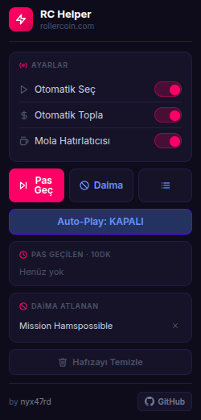
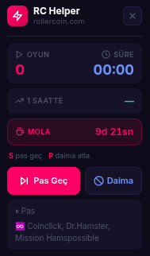
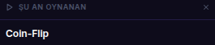
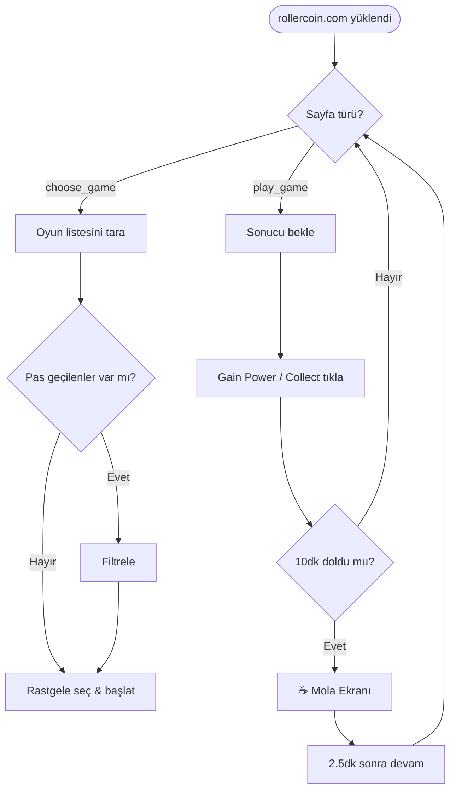

<div align="center">


</div>

<div align="center">


<br/><br/>

[](https://developer.chrome.com/docs/extensions/mv3/)
[](https://developer.mozilla.org/en-US/docs/Web/JavaScript)
[](https://chrome.google.com/webstore)
[](LICENSE)
[](https://github.com/nyx47rd/rchelper/stargazers)

</div>

---

## 🚀 Nedir?

**RC Helper**, [RollerCoin](https://rollercoin.com) platformu için geliştirilmiş bir Chrome eklentisidir. Oyunları sizin yerinize **oynamaz** — oyun seçim ekranında uygun oyunu otomatik seçer ve başlatır, geri kalanını siz yaparsınız. Power toplamayı ve mola yönetimini de otomatikleştirir.

<br/>

<div align="center">

| ⚡ Özellik | 📖 Açıklama |
|:---:|:---|
| 🎮 **Otomatik Oyun Seç** | Pas geçilmeyenler arasından rastgele oyun seçer ve başlatır |
| 💰 **Otomatik Topla** | *Gain Power* ve *Collect* butonlarına otomatik basar |
| ⏸ **Pas Geç · 10dk** | Seçili oyunu 10 dakika boyunca atlar, süre dolunca geri gelir |
| 🚫 **Daima Atla** | Oyunu kalıcı olarak engeller, hiç seçilmez |
| ☕ **Mola Hatırlatıcısı** | 10 dakika sonra tam ekran mola sayacı açar (2.5dk dinlen) |
| 📊 **Canlı İstatistik** | Oyun sayısı, süre ve saatlik tahmin widget'ı |
| ⌨️ **Klavye Kısayolları** | `S` pas geç · `P` daima atla |
| 🔊 **Ses Efektleri** | Oyun seçimi, pas geçme, mola başlangıcı/bitişi, otomasyon açma/kapama için farklı tonlar |

</div>

<br/>

---

## 📦 Kurulum

### Adım 1 — Dosyaları İndirin

1. Aşağıdaki butona tıklayın:

   [](https://github.com/nyx47rd/rchelper/releases/latest)

2. ZIP dosyasını masaüstüne çıkartın

---

### Adım 2 — Chrome'a Yükleyin

1. Chrome adres çubuğuna yazın:
   ```
   chrome://extensions
   ```

2. Sağ üst köşedeki **Geliştirici Modu** toggle'ını açın

3. **"Paketlenmemiş öğe yükle"** butonuna basın

4. ZIP'ten çıkardığınız klasörü seçin

5. ✅ Listede **RC Helper** gözükürse kurulum tamamdır!

---

### Adım 3 — Kullanmaya Başlayın

1. [rollercoin.com](https://rollercoin.com) adresine gidin
2. Tarayıcı araç çubuğundaki ⚡ ikonuna tıklayın
3. **Auto-Play: KAPALI** butonuna basın → **Auto-Play: AÇIK** 🟢

> Sayfa içinde sol üstte canlı istatistik widget'ı belirir.

<br/>

---

## 🖥️ Ekran Görüntüleri

<div align="center">

| Popup Paneli | Sayfa İçi Widget |
|:---:|:---:|
|  |  |
| Eklenti ikonuna tıklayarak açılır | Sayfanın sol üstünde sabit durur |

</div>

### Sağ Alt — Oyun Konsolu

Sayfanın sağ alt köşesinde küçük bir konsol widget'ı bulunur. Şu an oynanan oyunun adını gösterir. Kapatmak için sağ üst `✕` butonuna basılabilir, tekrar açmak için liste ikonuna tıklanır.

<div align="center">



</div>

<br/>

---

## ⌨️ Klavye Kısayolları

<div align="center">

| Tuş | Eylem | Detay |
|:---:|:---|:---|
| `S` | **Pas Geç** | Mevcut oyunu 10 dakika atlar |
| `P` | **Daima Atla** | Mevcut oyunu kalıcı olarak engeller |

> Kısayollar yalnızca `rollercoin.com` üzerinde, input/textarea odakta değilken çalışır.

</div>

<br/>

---

## 🔒 İzinler

<div align="center">

| İzin | Neden Gerekli |
|:---:|:---|
| `activeTab` | Aktif sekmede script çalıştırmak için |
| `scripting` | Sayfaya content script enjekte etmek için |
| `tabs` | Popup → sekme arası mesajlaşma için |
| `storage` | Ayarları ve pas geçilen oyunları kaydetmek için |

</div>

<br/>

---

## 🛠️ Teknoloji

<div align="center">


</div>

<br/>

```
📁 rchelper/
├── 📄 manifest.json      ← Eklenti tanımı (Manifest v3)
├── 📜 content.js         ← Sayfa içi otomasyon + widget UI
├── 📜 popup.js           ← Popup panel mantığı
├── 🎨 popup.html         ← Popup panel arayüzü
├── ⚙️  background.js     ← Service worker
└── 🖼️  icon*.png         ← Eklenti ikonları
```

**Öne çıkan teknik detaylar:**
- `chrome.storage.local` ile kalıcı durum yönetimi
- EMA (Exponential Moving Average) tabanlı saatlik tahmin algoritması
- Break checker 1 saniyelik tick — geri sayım piksel-perfect doğru
- Tüm UI vanilla JS + inline CSS (zero dependency)
- Manifest v3 + Service Worker mimarisi

<br/>

---

## 📈 Nasıl Çalışır?



<br/>

---

<div align="center">

### ⭐ Beğendiyseniz yıldız atmayı unutmayın!

[](https://github.com/nyx47rd/rchelper/stargazers)
[](https://github.com/nyx47rd/rchelper/network/members)

<br/>


</div>
