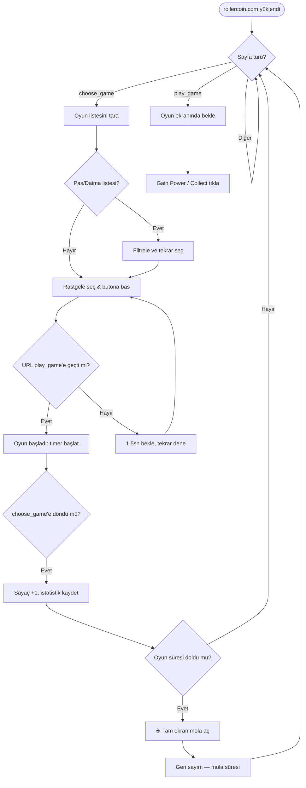

<div align="right">

[](README.md)

</div>

<div align="center">


</div>

<div align="center">


<br/><br/>

[](https://developer.chrome.com/docs/extensions/mv3/)
[](https://developer.mozilla.org/en-US/docs/Web/JavaScript)
[](https://chrome.google.com/webstore)
[](LICENSE)
[](https://github.com/nyx47rd/rchelper/stargazers)

<br/>


[](https://github.com/nyx47rd/rchelper/commits)
[](https://github.com/nyx47rd/rchelper/releases/latest)

</div>

---

## 🚀 Nedir?

**RC Helper**, [RollerCoin](https://rollercoin.com) platformu için geliştirilmiş, oyun otomasyonu ve güç toplama kolaylığı sağlayan açık kaynaklı bir Chrome eklentisidir (**RollerCoin Helper & Bot**). Eklenti, oyunları sizin yerinize robotik olarak oynamaz; bunun yerine oyun seçim ekranında en uygun oyunu otomatik olarak seçer, başlatır ve oyun bitiminde kazandığınız gücü (*Gain Power*) otomatik toplar.

Bu araç; güvenli bir RollerCoin asistanı, otomatik oyun seçici, otomatik güç toplayıcı (*auto collect*) ve akıllı mola hatırlatıcısı görevi görür.

> ⚠️ **Önemli:** RC Helper bir hile/hack aracı değildir. Yalnızca oyun *seçim* ve *toplama* işlemlerini otomatikleştirerek zaman kazandırır, RollerCoin kurallarını ihlal etmez.

<br/>

---

## ✨ Özellikler

<div align="center">

| ⚡ Özellik | 📖 Açıklama |
|:---:|:---|
| 🎮 **Otomatik Oyun Seç** | Pas geçilmeyenler arasından rastgele oyun seçer, butona basar ve başlatır |
| 💰 **Otomatik Topla** | Oyun bitince çıkan *Gain Power* ve *Collect* butonlarına otomatik basar |
| ⏸ **Pas Geç** | Seçili oyunu **10 dakika** boyunca atlar; süre dolunca listeye otomatik geri döner |
| 🚫 **Daima Atla** | Oyunu **kalıcı olarak** engeller; bir daha asla seçilmez |
| 📋 **Listeden Yönet** | Popup'tan tüm oyunları görerek tek tıkla pas geç veya daima atla listesine ekle/çıkar |
| ☕ **Mola Hatırlatıcısı** | Belirlenen süre sonunda tam ekran mola sayacı açılır; bittikten sonra otomatik devam eder |
| ⚙️ **Mola Ayarları** | Oyun süresi (1–120 dk) ve mola süresini (0.5–60 dk) popup'tan serbestçe ayarla |
| 📊 **İstatistikler** | Toplam/günlük/haftalık oyun sayısı, toplam süre, ort. süre, en çok oynanan ve daha fazlası |
| 🎯 **Şu An Oynanıyor** | Widget'ta aktif oyunun adı ve oturum sayacı canlı olarak gösterilir |
| 📈 **Saatlik Tahmin** | EMA algoritmasıyla o anki hızına göre saatte kaç oyun oynayacağını tahmin eder |
| 🛡️ **Güncelleme Koruması** | Eski sürümde auto-play otomatik engellenir; popup'ta güncelleme uyarısı gösterilir |
| 🎓 **İnteraktif Tutorial** | İlk açılışta spotlight'lı 11 adımlık tur; `?` butonuyla istediğin zaman tekrar açılır |
| ⌨️ **Klavye Kısayolları** | `S` = Pas Geç · `P` = Daima Atla |
| 🔊 **Ses Efektleri** | Oyun seçimi, pas geçme, mola başlangıcı/bitişi, otomasyon açma/kapama için farklı tonlar |
| 🗑️ **Hafızayı Temizle** | Tüm ayarları ve istatistikleri tek butonda sıfırla |
| 🤖 **Oyun Botları** | Coin Fisher, Hamster Climber ve 2048 Coins oyunlarını tam ekranda otomatik oynatır. Popup'tan her birini ayrı ayrı açıp kapatabilirsin. |

</div>

<br/>

---

## 📦 Kurulum

### Adım 1 — Dosyaları İndirin

[](https://github.com/nyx47rd/rchelper/releases/latest)

Releases sayfasından `rchelper-vX.X.X.zip` dosyasını indirip bir klasöre çıkartın.

---

### Adım 2 — Chrome'a Yükleyin

1. Adres çubuğuna `chrome://extensions` yazın
2. Sağ üst köşeden **Geliştirici Modu**'nu açın
3. **"Paketlenmemiş öğe yükle"** butonuna basın
4. Çıkardığınız `rchelper` klasörünü seçin
5. ✅ Listede **RC Helper** görünürse kurulum tamamdır

---

### Adım 3 — Kullanmaya Başlayın

1. [rollercoin.com](https://rollercoin.com) adresine gidin
2. Sağ üst köşedeki eklenti ikonuna tıklayın
3. İlk açılışta **interaktif tutorial** otomatik başlar
4. **Auto-Play: KAPALI** butonuna basın → **Auto-Play: AÇIK** 🟢

> Sayfanın sol üstünde canlı istatistik widget'ı belirir.

<br/>

---

## 🖥️ Popup Paneli

Eklenti ikonu tıklandığında açılan popup 256px genişliğinde bir kontrol panelidir. Bölümler:

| Bölüm | İçerik |
|:---|:---|
| **Başlık** | RC Helper logosu, sürüm bilgisi, `?` tutorial butonu |
| **Güncelleme Banner'ı** | Yeni sürüm varsa otomatik gösterilir, indirme bağlantısı içerir |
| **Ayarlar** | Otomatik Seç / Otomatik Topla / Mola Hatırlatıcısı toggle'ları |
| **Mola Ayarları** | Oyun süresi ve mola süresi sayısal inputları |
| **Oyun Botları** | Coin Fisher / Hamster Climber / 2048 Coins botlarını ayrı ayrı açıp kapatma. Aktif botlar "OYNUYOR" rozeti gösterir. |
| **Listeden Seç** | Tüm bilinen oyunları listeleyen panel (Pas Geç / Daima Atla butonlu) |
| **Pas Geç / Daima / Liste** | Hızlı aksiyon butonları |
| **Auto-Play** | Ana aç/kapat butonu |
| **Pas Geçilen · 10dk** | Geçici olarak atlanan oyunlar ve kalan süreleri |
| **Daima Atlanan** | Kalıcı engel listesi — X butonu ile kaldırılabilir |
| **İstatistikler** | 9 metriklik istatistik kartı + sıfırlama butonu |
| **Hafızayı Temizle** | Tüm `chrome.storage.local` verisini temizler |

<br/>

---

## 📊 Sayfa İçi Widget

Sayfanın **sol üst köşesinde** sabit bir kart görünür. İçerir:

- **Oturum sayacı** — bu oturumda oynanan oyun sayısı
- **Süre sayacı** — oturum başından itibaren geçen süre (mm:ss)
- **Saatlik tahmin** — EMA bazlı "saatte ~X oyun" tahmini (en az 3 oyun sonra görünür)
- **Break durumu** — mola aktifse kalan süre, değilse sonraki molaya kalan süre
- **Şu an oynanıyor** — oyun başladığında oyunun adını gösterir, bitince gizlenir
- **Konsol** — önemli sistem mesajlarını kırmızı renkte gösterir

Widget'ı kapatmak için sağ üst `✕` butonuna basılabilir. Tekrar açmak için köşede belirecek küçük liste ikonuna tıklanır.

<br/>

---

## ☕ Mola Sistemi

Mola hatırlatıcısı açık olduğunda şu döngü çalışır:

```
[Oyun oyna] ──(Oyun süresi doldu)──► [Tam ekran mola ekranı açılır]
                                              │
                                    (Mola süresi doldu veya
                                     "Molayı Bitir" tıklandı)
                                              │
                                              ▼
                                     [Otomatik devam]
```

**Mola ekranında** büyük bir geri sayım sayacı ve "Molayı Bitir" butonu görünür. Saatlik tahmin hesabı mola sürelerini otomatik olarak düşer.

**Mola Ayarları** popup'taki karttan değiştirilebilir:

| Ayar | Varsayılan | Aralık |
|:---|:---:|:---:|
| Oyun süresi | 10 dk | 1 – 120 dk |
| Mola süresi | 2.5 dk | 0.5 – 60 dk |

Değeri değiştirip inputtan çıkınca anında kaydedilir ve aktif sekmede geçerli olur.

<br/>

---

## 📈 İstatistikler

Popup'taki **İstatistikler** kartı her 3 saniyede otomatik güncellenir:

| Metrik | Açıklama |
|:---|:---|
| **Toplam Oyun** | Tüm zamanların toplam oyun sayısı |
| **Bugün** | Gün bazında oynanan oyun sayısı |
| **Bu Hafta** | Son 7 günün toplamı |
| **Toplam Süre** | Tüm oyunların toplam süresi |
| **Ort. Süre** | Oyun başına ortalama süre |
| **En Uzun** | Tek seferde oynanan en uzun oyun |
| **En Çok Oynanan** | Toplam oynama sayısına göre favori oyun |
| **Son Oyun** | En son oynanan oyunun adı |
| **Aktif Gün** | Kaç farklı günde oyun oynandığı |
| **Şu An Oynanan** | Anlık aktif oyun (content script'ten sorgulanır) |

Veriler `chrome.storage.local`'da saklanır. Sıfırlamak için kart başlığındaki 🔄 ikonuna basın.

<br/>

---

## 🎓 İnteraktif Tutorial

İlk kurulumda otomatik başlar. Popup başlığındaki **`?`** butonu ile istediğin zaman tekrar açılır.

**11 adım:**

| # | Hedef | Konu |
|:---:|:---|:---|
| 1 | — | Hoş geldin ekranı |
| 2 | Otomatik Seç toggle | Oyun seçimi otomasyonu |
| 3 | Otomatik Topla toggle | Power toplama otomasyonu |
| 4 | Mola Hatırlatıcısı toggle | Mola sistemi |
| 5 | Mola Ayarları kartı | Süre özelleştirme |
| 6 | Pas Geç butonu | Geçici atlama |
| 7 | Daima Atla butonu | Kalıcı engelleme |
| 8 | Liste butonu | Listeden yönetim |
| 9 | Auto-Play butonu | Ana kontrol |
| 10 | Oyun Botları kartı | Bot toggle yönetimi |
| 11 | İstatistikler kartı | Oyun takibi |

Her adımda hedef element **kırmızı spotlight** ile vurgulanır. Açıklama kutusu otomatik konumlanır ve ekran hedef elemente scroll eder.

<br/>

---

## 🛡️ Güncelleme Koruması

RC Helper her açılışta GitHub API'den son sürümü kontrol eder. Eğer kullandığın sürüm eskiyse:

- Auto-play **otomatik olarak engellenir**
- Popup'ta turuncu bir **güncelleme banner'ı** belirir
- Widget'ta ⚠️ uyarısı gösterilir

Bu sayede eski bir sürümün bozuk davranış göstermesi önlenir.

<br/>

---

## ⌨️ Klavye Kısayolları

<div align="center">

| Tuş | Eylem | Detay |
|:---:|:---|:---|
| `S` | **Pas Geç** | Mevcut oyunu 10 dakika atlar |
| `P` | **Daima Atla** | Mevcut oyunu kalıcı olarak engeller |

</div>

> Yalnızca `rollercoin.com` üzerinde, bir `input` veya `textarea` odakta değilken çalışır.

<br/>

---

## 🔒 İzinler

<div align="center">

| İzin | Neden Gerekli |
|:---:|:---|
| `activeTab` | Aktif sekmede script çalıştırmak için |
| `scripting` | Sayfaya content script enjekte etmek için |
| `tabs` | Popup → sekme arası mesajlaşma için |
| `storage` | Ayarları, istatistikleri ve atlanan oyunları kalıcı saklamak için |

</div>

<br/>

---

## ❓ Sık Sorulan Sorular

**Auto-Play açılmıyor, ne yapmalıyım?**
Eski sürüm kullanıyorsundur. Popup'ta güncelleme banner'ı çıktıysa son sürümü indirip yeniden yükle.

**Oyunun adı "Game-XXXX" şeklinde görünüyor.**
Oyun seçim sayfasındaki oyun henüz isim bilgisi yüklememiştir. Sayfa yenilenince düzelir.

**Pas geçtiğim oyun hâlâ seçiliyor.**
Atlama listesi 10 dakika sonra otomatik temizlenir. Süre dolmadan önce seçilmesini istemiyorsan "Daima Atla" kullan.

**Mola ekranı çok sık/az açılıyor.**
Popup → Mola Ayarları kartından oyun süresini artır veya azalt.

**İstatistikler sıfırlandı / kayboldu.**
"Hafızayı Temizle" butonu `chrome.storage.local`'ın tamamını siler. Bu butona dikkatli basılmalı.

**Widget sayfada görünmüyor.**
Sayfayı yenile. Eklenti bir content script olarak yüklenir; bazı sayfalarda gecikmeli başlayabilir.

**Oyun botu otomatik başlamıyor.**
Popup → Oyun Botları kartından botun açık olduğundan emin ol. Bot yalnızca tam ekrana alındığında devreye girer.

<br/>

## 🛠️ Teknoloji

<div align="center">


</div>

<br/>

```text
📁 rchelper/
├── 📄 manifest.json           ← Eklenti tanımı (Manifest v3)
├── 📜 content.js              ← Sayfa içi otomasyon + widget UI + mola sistemi
├── 📜 popup.js                ← Popup panel mantığı + istatistik okuma
├── 🎨 popup.html              ← Popup panel arayüzü + stilleri
├── 📜 i18n.js                 ← Çoklu dil (Internationalization) desteği
├── 🎓 tutorial.js             ← İnteraktif tutorial adımları + spotlight mantığı
├── 🎨 tutorial.css            ← Tutorial overlay stilleri
├── ⚙️  background.js          ← Service worker (Manifest v3 zorunluluğu)
├── 🎮 games/                  ← Oyuna özel mantık ve auto-play betikleri
└── 🖼️  icon16/48/128.png      ← Eklenti ikonları
```

**Öne çıkan teknik detaylar:**

- **URL geçiş izleyici** (`checkGameTransitions`) — sayaç oyun *başladığında* değil, *bittiğinde* artar; böylece başarısız girişimlerde false-positive olmaz
- **EMA** (Exponential Moving Average) bazlı saatlik tahmin — son 20 oyunun ağırlıklı ortalaması, mola sürelerini de hesaba katar
- **4-maske spotlight sistemi** — tutorial overlay `position:absolute` + scroll-aware koordinat hesabıyla her çözünürlükte doğru çalışır
- **Güncelleme koruması** — GitHub Releases API'den sürüm karşılaştırması, eski sürümde auto-play engeli
- **Sıfır bağımlılık** — tüm UI vanilla JS + inline/harici CSS, hiçbir npm paketi yok
- **Manifest v3** + Service Worker mimarisi

<br/>

---

## 📈 Nasıl Çalışır?



<br/>

---

<div align="center">

### ⭐ Beğendiyseniz yıldız atmayı unutmayın!

[](https://github.com/nyx47rd/rchelper/stargazers)
[](https://github.com/nyx47rd/rchelper/network/members)

<br/>


</div>
